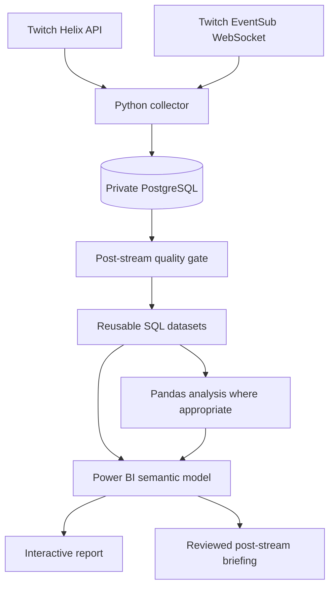

# POLYMATHIC Stream Pulse

POLYMATHIC Stream Pulse is a local-first Twitch analytics system for
[POLYMATHIC](https://www.twitch.tv/polymathic), a Drum & Bass DJ and Twitch
Ambassador based in The Hague. It captures live observations that cannot be
reliably reconstructed after a stream, validates collection quality, and is
being developed into a repeatable post-stream reporting product.

The goal is not to reproduce Twitch Creator Analytics. Stream Pulse is intended
to explain how a long stream developed, how chat presence differed from active
participation, what observable impact incoming raids had, and how community
participation changed across streams.

This is both a real product for POLYMATHIC and the developer's flagship
portfolio data project for summer 2027 internship applications. The repository
is intended to show not only a polished outcome, but also sound SQL, Pandas,
Power BI/DAX, data modeling, metric definition, and analytical reasoning.

> **Status:** active development. The four-source collector has completed a
> full live rehearsal. Milestone 1 enhanced collection is implemented;
> migrations 011–015, historical bridge derivation, Twitch reauthorization, and
> bounded live validation were completed September 16, 2026. Milestone 2's
> quality gate, analytical SQL, idempotent runner, metric dictionary, and curated
> three-page PBIP source are implemented and synthetically tested. The project
> opens successfully in Power BI Desktop and its pre-stream page layouts were
> visually accepted on September 16. Data from the September 17 POLYMATHIC
> stream was collected and reviewed in Power BI on September 18. That review
> identified a report redesign backlog; the recommendations are documented but
> not yet implemented or presented as final production acceptance.

## Why this exists

Twitch already gives creators viewer summaries and timelines, duration,
previous-stream comparisons, unique viewers, live views, unique chatters,
messages, follows, subscriptions, clips, discovery, revenue, and other native
analytics. Repackaging those statistics would add little value.

Stream Pulse instead focuses on questions such as:

* Did a busy chat period involve more people, or more messages from the same
  small group?
* Did an incoming raid correspond with a sustained change in viewer count,
  chat presence, active participation, or follows?
* How did different raid-source contexts compare over 5-, 15-, 30-, and
  60-minute windows?
* Did Twitch identify first-time chatters among the messages observed during the
  stream?
* Where do collection gaps limit what can be concluded?

Native Twitch metrics may appear as context, but they are not the product's
main value claim. See the full [product and reporting direction](docs/product-and-reporting-direction.md).

Development is delivery-focused: the owner directs the product and AI handles
implementation across the stack. Important decisions, analytical limitations,
and AI assistance should remain clear. The initial MVP targets a small,
complete slice built in roughly five to seven focused days.

## Intended deliverables

After a stream ends, the separate post-stream workflow:

1. associate the stream with all relevant collector runs;
2. validate orderly closure, source coverage, and collection gaps;
3. classify the result as publishable, publishable with warnings, or blocked;
4. update reusable SQL analytical datasets;
5. record when Pandas is unnecessary rather than duplicating SQL definitions;
6. refresh the Power BI semantic model and report;
7. prepare a concise briefing for review.

The two user-facing outputs are:

* an interactive Power BI report for single-stream and longitudinal analysis;
* a concise PDF, image, or written recap suitable for sending soon after the
  stream.

Delivery will initially remain human-reviewed. Automatic sending is deliberately
deferred so an analytically correct but contextually misleading observation is
not delivered without review.

## Architecture



Collection runs in WSL2 on the operator's Windows PC. Power BI Desktop runs on
Windows and connects to the local PostgreSQL database. The initial deployment is
intentionally local: the PC must remain awake, WSL2 and the collector must remain
running, and network access must remain available.

## Current collection

The migrated merged collector records:

| Source | Grain | Purpose |
|---|---|---|
| Streams | One row per observed Twitch stream | Broadcast boundaries |
| Viewer snapshots | One row per stream × observation time | Aggregate viewer timeline |
| Chat messages | One row per EventSub delivery | Active chat participation |
| Incoming raids | One row per raid delivery | Raid timing and reported size |
| Follow events | One row per follow delivery | Follow timing |
| Collector runs | One row per process run | Operational lifecycle |
| Collection health | One row per source health transition | Coverage evidence |
| Reconnection gaps | One row per unexpected EventSub gap | Known missing-delivery periods |
| Run/stream bridge | One row per collector run × observed stream | Direct quality attribution |
| Run capabilities | One row per run × supported capability | Configured, disabled, or failed initialization |
| Chatter-presence snapshots | One row per attempted five-minute snapshot | Presence coverage and completion evidence |
| Chatter-presence members | One row per snapshot × Twitch user ID | Presence versus active participation |
| Stream metadata history | One row per observed metadata version | Reproducible title/category/language/tag context |
| Raid-source context | One result per newly stored raid | Near-event source metadata and enrichment outcome |

The collector uses one cooperative coordinator for viewer polling and EventSub
chat, raid, and follow capture. It records per-source health, maintains a
heartbeat, preserves reconnection gaps, and shuts all active sources down in one
database transaction when possible.

The milestone 1 implementation adds:

* collector-run-to-stream attribution;
* five-minute Twitch-reported chatter-presence snapshots;
* chat message type, reply, and badge/role context;
* timestamped raid-source metadata;
* stream metadata history when Twitch reports changes.

Historical raw rows retain NULL `run_id` and chat-context fields. They are not
backfilled from current Twitch state. The separate historical bridge derivation
uses only uniquely matched viewer-snapshot/run intervals and labels those rows
as derived rather than direct capture. See the [schema and grains](docs/schema.md).

Subjective operator annotations and manual audience-fit classifications are
explicitly excluded.

## Repository layout

```text
scripts/                     Twitch authorization, collection, recovery, storage
sql/                         Numbered collection and analytical schema files
sql/analysis/                Operational and exploratory analytical queries
tests/                       Synthetic and PostgreSQL integration tests
docs/                        Collection contracts, runbooks, and product design
stream-pulse.Report/         Power BI report definition
stream-pulse.SemanticModel/  Power BI semantic-model definition
stream-pulse.pbip            Power BI Desktop project entry point
```

## Technology

* Python 3.10+
* PostgreSQL
* SQL
* Pandas where relational SQL is not the best analytical tool
* Power BI Desktop and TMDL/PBIP source files
* Twitch Helix API and EventSub WebSockets

## Local setup

### Prerequisites

* Python 3.10 or newer
* PostgreSQL available from WSL2
* A confidential Twitch application
* A Twitch moderator account for the target channel
* Power BI Desktop on Windows for report development

Create the Python environment:

```bash
python3 -m venv .venv
.venv/bin/python -m pip install -r requirements.txt
```

Create a fresh local database and apply the numbered schema files in order:

```bash
createdb stream_pulse
for migration in sql/[0-9][0-9][0-9]_*.sql; do
  psql -v ON_ERROR_STOP=1 -d stream_pulse -f "$migration"
done
```

The schema files are ordered setup migrations, not idempotent commands. Do not
rerun them against an initialized database.

### Twitch authorization

Register `http://localhost:3000/callback` as the Twitch application's OAuth
redirect URL. Create an ignored `.env` file at the repository root:

```dotenv
TWITCH_CLIENT_ID=replace_me
TWITCH_CLIENT_SECRET=replace_me
TWITCH_REDIRECT_URI=http://localhost:3000/callback
```

Authorize using the operator's moderator account:

```bash
.venv/bin/python -m scripts.authorize_twitch
.venv/bin/python -m scripts.check_twitch_access
```

The authorization helper uses the OAuth authorization-code flow, validates the
returned token, and stores credentials in the ignored, owner-only
`.env.tokens.json` file. Diagnostics never intentionally print tokens, private
identity values, or raw API responses. Milestone 1 adds the optional
`moderator:read:chatters` scope; reauthorize with the collector stopped before
enabling presence capture. If it is missing, the main collector records that
capability as failed to initialize and continues its core sources.

Only one token-writing process should run at a time. Do not run authorization,
access checks, readiness probes, or a second collector beside the live collector.

### Run the collector

```bash
.venv/bin/python -m scripts.collect_stream
```

Useful restricted modes are available for diagnosis:

```bash
.venv/bin/python -m scripts.collect_stream --no-chat
.venv/bin/python -m scripts.collect_stream --no-eventsub
.venv/bin/python -m scripts.collect_stream --no-presence
.venv/bin/python -m scripts.collect_stream --duration 180
```

The default command makes real Twitch requests and writes real observations to
the private database. Ctrl+C or SIGTERM requests an orderly shutdown. Full
operating procedures, expected health transitions, and post-run checks are in
the [merged collector rehearsal runbook](docs/merged-rehearsal-runbook.md).

### Run tests

Run the synthetic suite:

```bash
.venv/bin/python -m unittest discover -s tests -v
```

Include PostgreSQL integration tests, which use session-temporary synthetic
tables rather than production rows:

```bash
STREAM_PULSE_TEST_POSTGRES=1 \
  .venv/bin/python -m unittest discover -s tests -v
```

## Power BI project

Open `stream-pulse.pbip` in Power BI Desktop. The current semantic-model
definitions use an import connection to `localhost:5432`, database
`stream_pulse`; local credentials must be configured on the developer machine.

The source-controlled PBIP/TMDL definitions contain model and report metadata.
Power BI's local settings and `cache.abf` are ignored because the cache contains
a local copy of imported model data. No imported production data should ever be
committed.

The model imports curated stream, participation, raid-impact, community,
historical-comparison, date, and quality datasets. It does not import raw chat
text or raw participant identities. The report defines Stream evolution, Raid
impact, and Community and comparison pages. Source metadata validates as PBIR
JSON, and the project has opened successfully in Power BI Desktop with its page
layouts visually accepted. The first official stream still requires a fresh
data load and reconciliation against the generated briefing and SQL.

## Privacy

Production data may contain real Twitch usernames, user IDs, raw chat messages,
and private behavioral history. It remains local.

The public repository must contain only source code, metadata, documentation,
and anonymized, aggregated, sanitized, or synthetic examples. Specifically,
never commit:

* `.env` files, OAuth tokens, or credentials;
* the production PostgreSQL database or exports;
* raw chat logs or real user mappings;
* Power BI `cache.abf` or `localSettings.json` files;
* recaps containing private identifiers.

When a public sample must preserve cross-stream identity, it will use
deterministic anonymous identifiers.

## Analytical limitations

* Aggregate viewer counts do not identify individual viewers.
* Users connected to Twitch chat are not confirmed video viewers.
* Twitch chatter-presence data may lag joins and leaves.
* The current local first-observed/returning/recurring classifications are
  provisional implementation artifacts scheduled for removal from the artist-
  facing report; they do not represent Twitch's full channel history.
* Chat-presence analysis is not viewer-retention analysis.
* Reported raid size and measured net viewer change are different quantities.
* Event-window associations do not establish causation.
* Missing collection intervals must remain visible and may block a conclusion.

## Documentation

* [Product and reporting direction](docs/product-and-reporting-direction.md)
* [Collection policy and health contracts](docs/collection-policy.md)
* [Merged collector design](docs/merged-collector-design.md)
* [Merged collector rehearsal runbook](docs/merged-rehearsal-runbook.md)
* [Collection schema and grains](docs/schema.md)
* [Milestone 1 release handoff](docs/milestone-1-release-handoff.md)
* [Milestone 2 pre-stream release handoff](docs/milestone-2-release-handoff.md)
* [Metric dictionary](docs/metric-dictionary.md)
* [Post-stream reporting runbook](docs/post-stream-runbook.md)
* [September 18 Power BI production-data review](docs/power-bi-review-notes-2026-09-18.md)

The standalone [EventSub rehearsal runbook](docs/eventsub-rehearsal-runbook.md)
is retained as historical validation documentation; the merged runbook is the
current operating reference.

## Roadmap

Milestone specifications and execution records:

* [Milestone 1: reliable enhanced collection](docs/milestone-1-enhanced-collection.md)
* [Milestone 2: repeatable post-stream reporting](docs/milestone-2-post-stream-reporting.md)

- [x] OAuth, token validation, and bounded refresh behavior
- [x] Viewer polling with stream and run lifecycle persistence
- [x] EventSub raid and follow capture
- [x] Observed-live chat capture
- [x] Per-source health and durable reconnection-gap records
- [x] Full four-source live rehearsal
- [x] Source-controlled Power BI project scaffold
- [x] Run-to-stream bridge
- [x] Chatter-presence collection
- [x] Chat and raid contextual enrichment
- [ ] Milestone 1 full-stream production verification
- [x] Post-stream quality gate
- [x] Curated analytical datasets and metric definitions
- [x] Curated Power BI semantic-model and three-page report source
- [x] Power BI Desktop project open and pre-stream page-layout inspection
- [x] Reviewed post-stream briefing generator and workflow manifest
- [ ] Complete the September 17 official-data acceptance, implement the reviewed
  report changes, and reconcile the redesigned outputs
- [ ] Optional Power BI Service refresh and delivery automation
