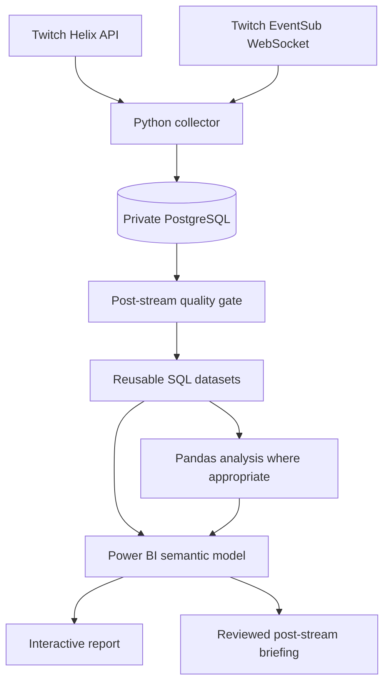

# POLYMATHIC Stream Pulse

POLYMATHIC Stream Pulse is a local-first Twitch analytics system for
[POLYMATHIC](https://www.twitch.tv/polymathic), a Drum & Bass DJ and Twitch
Ambassador based in The Hague. It captures live observations that cannot be
reliably reconstructed after a stream, validates collection quality, and is
being developed into a repeatable post-stream reporting product.

The goal is not to reproduce Twitch Creator Analytics. Stream Pulse is intended
to explain how a long stream developed, how chat presence differed from active
participation, what observable impact incoming raids had, and how community
participation changed across streams.

> **Status:** active development. The four-source collector has completed a
> full live rehearsal. The analytical model, enhanced collection schema,
> post-stream quality gate, and final Power BI report are the current product
> work; the included Power BI project is an initial source-controlled scaffold,
> not a finished report.

## Why this exists

Twitch already gives creators viewer summaries and timelines, duration,
previous-stream comparisons, unique viewers, live views, unique chatters,
messages, follows, subscriptions, clips, discovery, revenue, and other native
analytics. Repackaging those statistics would add little value.

Stream Pulse instead focuses on questions such as:

* Did a busy chat period involve more people, or more messages from the same
  small group?
* Did an incoming raid correspond with a sustained change in viewer count,
  chat presence, active participation, or follows?
* How did different raid-source contexts compare over 5-, 15-, 30-, and
  60-minute windows?
* Which chat participants were first observed, returning, or recurring?
* How do Tuesday, Thursday, and Sunday streams compare at the same elapsed
  stream time?
* Where do collection gaps limit what can be concluded?

Native Twitch metrics may appear as context, but they are not the product's
main value claim. See the full [product and reporting direction](docs/product-and-reporting-direction.md).

## Intended deliverables

After a stream ends, a separate post-stream workflow will:

1. associate the stream with all relevant collector runs;
2. validate orderly closure, source coverage, and collection gaps;
3. classify the result as publishable, publishable with warnings, or blocked;
4. update reusable SQL analytical datasets;
5. run Pandas analyses where they add value;
6. refresh the Power BI semantic model and report;
7. prepare a concise briefing for review.

The two user-facing outputs will be:

* an interactive Power BI report for single-stream and longitudinal analysis;
* a concise PDF, image, or written recap suitable for sending soon after the
  stream.

Delivery will initially remain human-reviewed. Automatic sending is deliberately
deferred so an analytically correct but contextually misleading observation is
not delivered without review.

## Architecture



Collection runs in WSL2 on the operator's Windows PC. Power BI Desktop runs on
Windows and connects to the local PostgreSQL database. The initial deployment is
intentionally local: the PC must remain awake, WSL2 and the collector must remain
running, and network access must remain available.

## Current collection

The merged collector currently records:

| Source | Grain | Purpose |
|---|---|---|
| Streams | One row per observed Twitch stream | Broadcast boundaries |
| Viewer snapshots | One row per stream × observation time | Aggregate viewer timeline |
| Chat messages | One row per EventSub delivery | Active chat participation |
| Incoming raids | One row per raid delivery | Raid timing and reported size |
| Follow events | One row per follow delivery | Follow timing |
| Collector runs | One row per process run | Operational lifecycle |
| Collection health | One row per source health transition | Coverage evidence |
| Reconnection gaps | One row per unexpected EventSub gap | Known missing-delivery periods |

The collector uses one cooperative coordinator for viewer polling and EventSub
chat, raid, and follow capture. It records per-source health, maintains a
heartbeat, preserves reconnection gaps, and shuts all active sources down in one
database transaction when possible.

The next approved collection changes are:

* collector-run-to-stream attribution;
* five-minute Twitch-reported chatter-presence snapshots;
* chat message type, reply, and badge/role context;
* timestamped raid-source metadata;
* stream metadata history when Twitch reports changes.

Subjective operator annotations and manual audience-fit classifications are
explicitly excluded.

## Repository layout

```text
scripts/                     Twitch authorization, collection, recovery, storage
sql/                         Numbered schema files and reusable queries
sql/analysis/                Early exploratory analytical queries
tests/                       Synthetic and PostgreSQL integration tests
docs/                        Collection contracts, runbooks, and product design
stream-pulse.Report/         Power BI report definition
stream-pulse.SemanticModel/  Power BI semantic-model definition
stream-pulse.pbip            Power BI Desktop project entry point
```

## Technology

* Python 3.10+
* PostgreSQL
* SQL
* Pandas where relational SQL is not the best analytical tool
* Power BI Desktop and TMDL/PBIP source files
* Twitch Helix API and EventSub WebSockets

## Local setup

### Prerequisites

* Python 3.10 or newer
* PostgreSQL available from WSL2
* A confidential Twitch application
* A Twitch moderator account for the target channel
* Power BI Desktop on Windows for report development

Create the Python environment:

```bash
python3 -m venv .venv
.venv/bin/python -m pip install -r requirements.txt
```

Create a fresh local database and apply the numbered schema files in order:

```bash
createdb stream_pulse
for migration in sql/[0-9][0-9][0-9]_*.sql; do
  psql -v ON_ERROR_STOP=1 -d stream_pulse -f "$migration"
done
```

The schema files are ordered setup migrations, not idempotent commands. Do not
rerun them against an initialized database.

### Twitch authorization

Register `http://localhost:3000/callback` as the Twitch application's OAuth
redirect URL. Create an ignored `.env` file at the repository root:

```dotenv
TWITCH_CLIENT_ID=replace_me
TWITCH_CLIENT_SECRET=replace_me
TWITCH_REDIRECT_URI=http://localhost:3000/callback
```

Authorize using the operator's moderator account:

```bash
.venv/bin/python -m scripts.authorize_twitch
.venv/bin/python -m scripts.check_twitch_access
```

The authorization helper uses the OAuth authorization-code flow, validates the
returned token, and stores credentials in the ignored, owner-only
`.env.tokens.json` file. Diagnostics never intentionally print tokens, private
identity values, or raw API responses.

Only one token-writing process should run at a time. Do not run authorization,
access checks, readiness probes, or a second collector beside the live collector.

### Run the collector

```bash
.venv/bin/python -m scripts.collect_stream
```

Useful restricted modes are available for diagnosis:

```bash
.venv/bin/python -m scripts.collect_stream --no-chat
.venv/bin/python -m scripts.collect_stream --no-eventsub
.venv/bin/python -m scripts.collect_stream --duration 180
```

The default command makes real Twitch requests and writes real observations to
the private database. Ctrl+C or SIGTERM requests an orderly shutdown. Full
operating procedures, expected health transitions, and post-run checks are in
the [merged collector rehearsal runbook](docs/merged-rehearsal-runbook.md).

### Run tests

Run the synthetic suite:

```bash
.venv/bin/python -m unittest discover -s tests -v
```

Include PostgreSQL integration tests, which use session-temporary synthetic
tables rather than production rows:

```bash
STREAM_PULSE_TEST_POSTGRES=1 \
  .venv/bin/python -m unittest discover -s tests -v
```

## Power BI project

Open `stream-pulse.pbip` in Power BI Desktop. The current semantic-model
definitions use an import connection to `localhost:5432`, database
`stream_pulse`; local credentials must be configured on the developer machine.

The source-controlled PBIP/TMDL definitions contain model and report metadata.
Power BI's local settings and `cache.abf` are ignored because the cache contains
a local copy of imported model data. No imported production data should ever be
committed.

The current model imports the collection tables and is an exploratory starting
point. It will be replaced or reshaped around curated analytical datasets as the
post-stream metrics are implemented.

## Privacy

Production data may contain real Twitch usernames, user IDs, raw chat messages,
and private behavioral history. It remains local.

The public repository must contain only source code, metadata, documentation,
and anonymized, aggregated, sanitized, or synthetic examples. Specifically,
never commit:

* `.env` files, OAuth tokens, or credentials;
* the production PostgreSQL database or exports;
* raw chat logs or real user mappings;
* Power BI `cache.abf` or `localSettings.json` files;
* recaps containing private identifiers.

When a public sample must preserve cross-stream identity, it will use
deterministic anonymous identifiers.

## Analytical limitations

* Aggregate viewer counts do not identify individual viewers.
* Users connected to Twitch chat are not confirmed video viewers.
* Twitch chatter-presence data may lag joins and leaves.
* “First observed” does not mean a person's first-ever channel visit.
* Returning-chatter and chat-presence analyses are not viewer-retention analyses.
* Reported raid size and measured net viewer change are different quantities.
* Event-window associations do not establish causation.
* Missing collection intervals must remain visible and may block a conclusion.

## Documentation

* [Product and reporting direction](docs/product-and-reporting-direction.md)
* [Collection policy and health contracts](docs/collection-policy.md)
* [Merged collector design](docs/merged-collector-design.md)
* [Merged collector rehearsal runbook](docs/merged-rehearsal-runbook.md)

## Roadmap

- [x] OAuth, token validation, and bounded refresh behavior
- [x] Viewer polling with stream and run lifecycle persistence
- [x] EventSub raid and follow capture
- [x] Observed-live chat capture
- [x] Per-source health and durable reconnection-gap records
- [x] Full four-source live rehearsal
- [x] Source-controlled Power BI project scaffold
- [ ] Run-to-stream bridge
- [ ] Chatter-presence collection
- [ ] Chat and raid contextual enrichment
- [ ] Post-stream quality gate
- [ ] Curated analytical datasets and metric definitions
- [ ] Final Power BI semantic model and report
- [ ] Reviewed post-stream briefing generator
- [ ] Optional Power BI Service refresh and delivery automation
