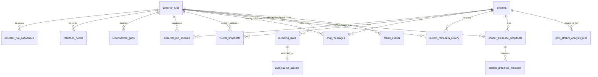

# Collection schema and grains

This diagram describes the private PostgreSQL collection model after migrations
011–015 and the reporting manifest added by migration 016. Identity-bearing
values remain private even though table definitions are source controlled.

Important grains:

- `collector_run_streams`: one run × stream, with first/last successful poll
  observations and a direct-versus-derived attribution method.
- `chatter_presence_snapshots`: one attempted census. Only `complete` rows are
  eligible for metrics requiring complete membership.
- `chatter_presence_members`: one snapshot × Twitch user ID. Presence is not
  video viewership and may lag joins/leaves.
- `stream_metadata_history`: one observed version per stream; unchanged values,
  including reordered tags, do not create a row.
- `raid_source_context`: at most one logical enrichment outcome per stored raid.
  Its metadata is observed near the raid, not guaranteed event-time truth.
- Nullable raw `run_id` values mean direct provenance was unavailable, normally
  because the row predates migration 011. Historical derivation never fills them.
- `post_stream_analysis_runs`: one analysis version × stream × deterministic
  input fingerprint. It records quality and workflow state; it does not copy or
  mutate raw facts.

Migrations 016–017 also expose reusable views rather than materialized facts:

| View | Grain |
|---|---|
| `analytics_event_associations` | Follow/raid event |
| `analytics_source_intervals` | Stream × run × source-state interval |
| `analytics_healthy_source_intervals` | Stream × source × unioned healthy interval |
| `analytics_stream_participation` | Stream × elapsed five-minute window |
| `analytics_stream_events` | Stream × elapsed five-minute window |
| `analytics_raid_impact` | Resolved raid × horizon |
| `analytics_chatter_participation` | Stream × anonymized active chatter |
| `analytics_historical_comparison` | Stream × elapsed five-minute window |
| `analytics_quality_source` | Stream × source |
| `analytics_stream_dimension` | Stream |
| `analytics_date_dimension` | Amsterdam local date |
| `analytics_community_summary` | Stream |
